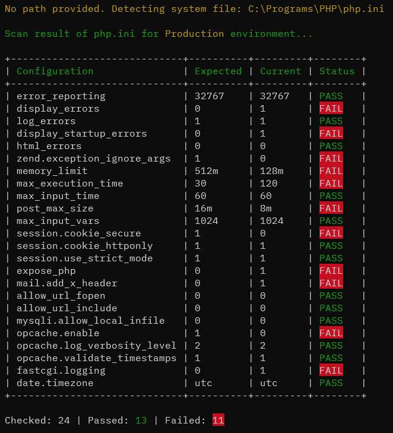

# PHP INI Scanner

A lightweight CLI tool to audit php.ini configurations against development and production standards.

It compares given settings against industry-standard recommendations for either **Development** or **Production** environments.

_Built using **SOLID** principles, strict_types=1 and PSR compliance._

## Requirements

1. PHP >= 7.4
2. Composer >= 2

## Screenshots



## Installation

Via [Composer](https://getcomposer.org/) per project:

```shell
composer require yousha/php-ini-scanner
```

Or via [Composer](https://getcomposer.org/) globally:

```shell
composer global require yousha/php-ini-scanner
```

## Usage

### Scan for Production

Checks for production environment settings:

```bash
php ./vendor/bin/php-ini-scanner scan -p -i /path/to/php.ini

```

### Scan for Development

Checks for debugging-friendly settings:

```bash
php ./vendor/bin/php-ini-scanner scan -d -i /path/to/php.ini

```

## Commands

| Option | Shortcut | Description |
| --- | --- | --- |
| `--production` | `-p` | Uses production rule set. |
| `--development` | `-d` | Uses development rule set. |
| `--ini-path` | `-i` | Path to `php.ini` file. |

## License

This open-source software is distributed under the GPL-3.0 license. See [LICENSE](LICENSE) file.
